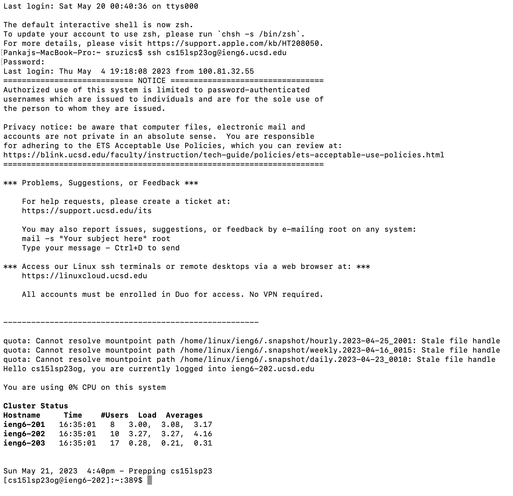

# Lab Report 4

## Step 1
In order to log into ieng6, I typed the command `ssh cs15lsp23og@ieng6.ucsd.edu` then `<return>` and it prompted me to type in my password. Once I typed in my password and pressed `<return>`, I was logged into ieng6.

## Step 2
Next, you need to clone the forked repository that is now in your GitHub account. Open up the fork repository in your search engine. Click on code and you should see a link. Click the button with the two overlapping squares to copy the link. You should see a checkmark to confirm that the link has been copies. Your screen should look like this:

Navigate back to your terminal and type `git clone` followed by the link you just copied. Press `<return>` to clone the repository. Your terminal should look something like this:

## Step 3
Now, we need to run the JUnit tests in order to see the failures present. In order to do this, we need to set the current directory to lab7 that we just cloned. First, type in the `ls` command and `<return>` to see the directories available. If lab7 is present, that means that the file was cloned correctly. Once you see lab7, type in `cd lab7` then `<return>` to set the current directory to lab7. Type in the `ls` command again and press `<return>` to verify that lab7 is our current directly and see all the files in lab7. Your terminal should look something like this:

  
Once we are in the right directory, we need to run the JUnit tests. First run the command `javac -cp .:lib/hamcrest-core-1.3.jar:lib/junit-4.13.2.jar *.java` and press `<return>`. Nothing should return from this command. Then to run the tests, type in the command `java -cp .:lib/hamcrest-core-1.3.jar:lib/junit-4.13.2.jar org.junit.runner.JUnitCore ListExamplesTests` and press `<return>`. The tests should run and you should see that two tests were run and that there was one failure. The terminal should look something like this:

## Step 4
In order to get to the file we want to edit, type the `vim ListExamples.java` command. You should se the text file pop up. Press `<k>` six times to get to the line and word that we want to fix. Press `<x>` to delete the "1" in "index1". Then press `<i>` to activate the insert command. Press `<2>` to insert 2 into the code. Then press `<esc>` to get out of the insert command. Your changes should look like this:

Type `:wq!` to save and exit out of the file. The changes should now be made into the file.
  
## Step 5
Now, we need to re-run the JUnit tests to see that the tests now succeed. First run the command `javac -cp .:lib/hamcrest-core-1.3.jar:lib/junit-4.13.2.jar *.java` and press `<return>`. Nothing should return from this command. Then to run the tests, type in the command `java -cp .:lib/hamcrest-core-1.3.jar:lib/junit-4.13.2.jar org.junit.runner.JUnitCore ListExamplesTests` and press `<return>`. The tests should run and you should see that two tests were run and that all of the tests pass now. The terminal should look something like this:

## Step 6
Now that all of the changes have been made and that the tests passed, you need to commit and push the changes back into your GitHub account. First type the command `git add ListExamples.java` then press `<return>`. Next, type `git commit -m "Errors in tests fixed."` then `<return>` to commit the changes. Finally to push the changes back to your account by typing `git push`. 

