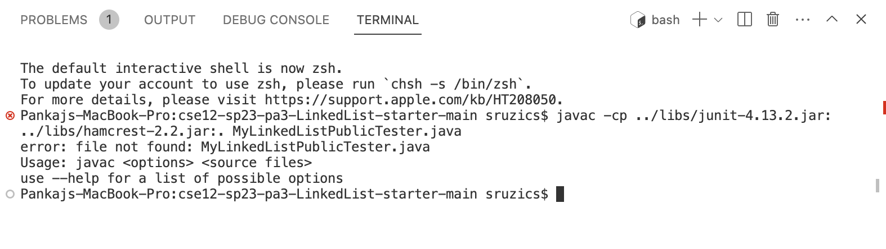
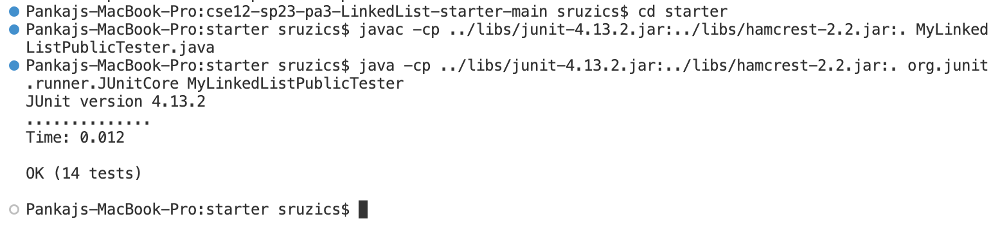

# Lab Report 5

## Part 1
* The following image is a post made by a student in CSE15L that is having an issue running JUnit tests command-line;


* To this particular error, a TA should help the student with the following response:
```
Are you sure you are in the right folder in the terminal? Try to use the `cd` command to into the correct folder that the java file is in to run the test.
```
This specific response is good because it not only asks a leading question, but also gives a hint to what command the student should use without entirely giving the answer away. This response also helps the student because it also explains why the student's command is not working and what would fix it.

* The student uses the hint given by the TA then fixes the issue:


* The file that the student was working with was MyLinkedListPublicTester.java which is in the starter directory. The file contained JUnit tests to test the code of MyLinkedList. The JUnit test compiler on command-line was not compiling because the current directory was not set to starter. First, you need to run the command `cd starter` and then run the compile and run commands which are `javac -cp ../libs/junit-4.13.2.jar:../libs/hamcrest-2.2.jar:. MyLinkedListPublicTester.java` and `java -cp ../libs/junit-4.13.2.jar:../libs/hamcrest-2.2.jar:. org.junit.runner.JUnitCore MyLinkedListPublicTester`. Now the tests will run and pass. The `cd starter` command would fix the "file not found" error.

## Part 2
I think the most useful command I learned in the second half of the quarter was the `vim` command. I think this command is very useful if VS Code was not working or if you code entirely on command-line. It was very new to me because I did not realize that you could just code in command-line and did not necessarily need an application to code. 
