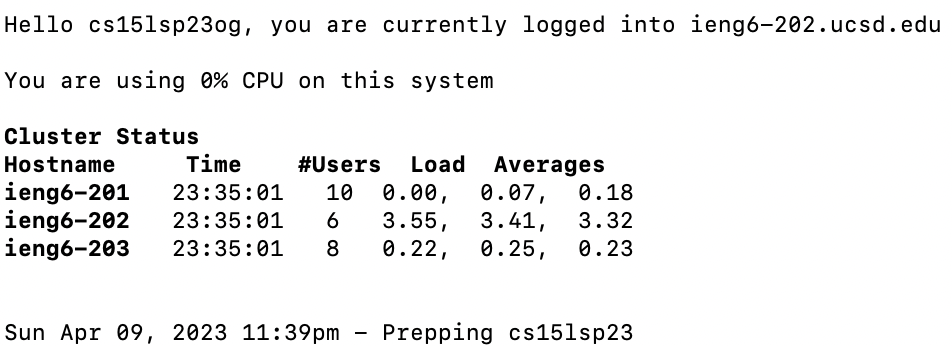

# Lab Report 1
## Installing VS Code:
In order to install VS Code on a Mac, you need to go to the website https://code.visualstudio.com/ and follow the instructions to download VS code. You will have to scroll down and click the download button, then follow the prompted instructions. Because I already had VS Code downloaded on my Mac, I did not need to complete this step.
Insert Image Here

## Remotely Connecting: 
In order to remotely connect, open up your terminal on your Macbook (you can search this up in the searchbar). Type in the following command into the terminal, replacing the "zz" with your personal account letters: ssh cs15lsp23zz@ieng6.ucsd.edu. Initially, this did not work for me, but it was eventually fixed and I was able to see the screen shown below. Now, you are logged in and your computer is connected to a computer in the CSE basement.

## Trying Some Commands:
Now that you have logged in, you can try some commands. These include cd, ls, pwd, mkdir, and cp. You can test these commands out and any other commands in the terminal to see the ouput. The image below shows an example of the output of ls -lat on my computer.
Insert Image Here
