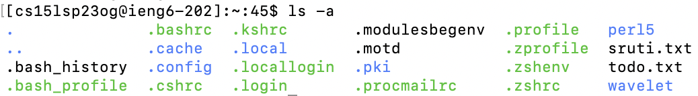
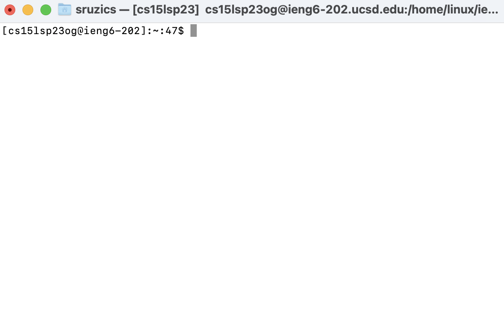
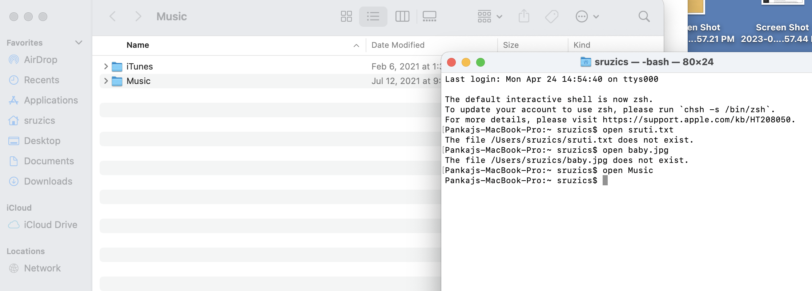

# Lab Report 1
## Installing VS Code:
In order to install VS Code on a Mac, you need to go to the website [https://code.visualstudio.com/](https://code.visualstudio.com/) and follow the instructions to download VS code. You will have to scroll down and click the download button, then follow the prompted instructions. The prompted instructions will involve you double-clicking the application and allowing it to appear as an icon on your computer. Windows may have slightly different steps. Because I already had VS Code downloaded on my Mac, I did not need to complete this step.


## Remotely Connecting: 
In order to remotely connect, open up your terminal on your Macbook (you can search this up in the searchbar). Type in the following command into the terminal, replacing the "zz" with your personal account letters that you can find in your triton link:
```
ssh cs15lsp23zz@ieng6.ucsd.edu
```
Initially, this did not work for me, but it was eventually fixed and I was able to see the screen shown below. The issue I had was something that needed to be fixed on the backend, which was fixed by UCSD's technical department. Now, you are logged in and your computer is connected to a computer in the CSE basement.


## Trying Some Commands:
Now that you have logged in, you can try some commands. These include `cd`, `ls`, `pwd`, `mkdir`, and `cp`. You can test these commands out and any other commands in the terminal to see the ouput. Here are some examples of other commands:
* You can use the `touch` command to create a new file. In your terminal, simply type a file name next to the touch commmand to create a new file with your desired file name. This command is very useful if you want to create a file quickly, this command can be very useful since you will just need to open up your terminal then type this quick command. You can easily create the file type and file name that you want. See the example below:

* You can use the `ls -a` command to show all of the hidden files or directories. This is useful when you are struggling to find a file and want to check if it could be hidden. It shows all of the files at once so you can easily locate what yoyu are looking for. See the example below:

* Sometimes, your terminal will become too crowded with previous commands and outputs and you need a fresh start. You can use the `clear` command to clear the terminal of all commands that were entered. This will also remove the fact that you entered clear, so be aware of that. The image below is after I entered the clear command. As you can see, it left me with a blank terminal with the cursor ready for me to type a new command.

* It can definitely become a hassle to remove a file as you need to find it in your Finder and delete it. The `rm` command removes a file. You need to enter rm and then the name of the file that you want to remove next to it. Nothing will output from it. This command makes it a lot easier to remove a file.

* In order to open a specific file, you need to use the `open` command. Type open and then the file you want to open and the file will open in the directory. This is also a useful command as it eliminates the time needed to search for a file and will automatically open it in a new window as you can see in the picture:

