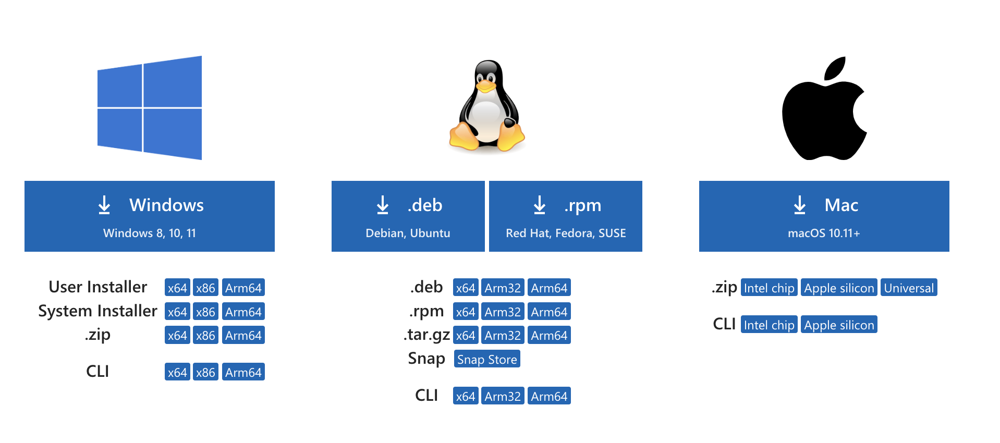
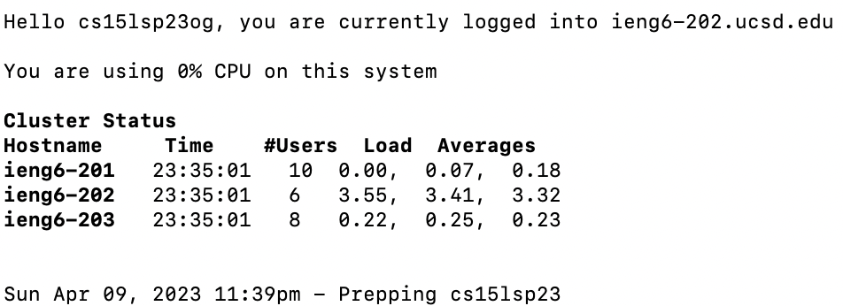
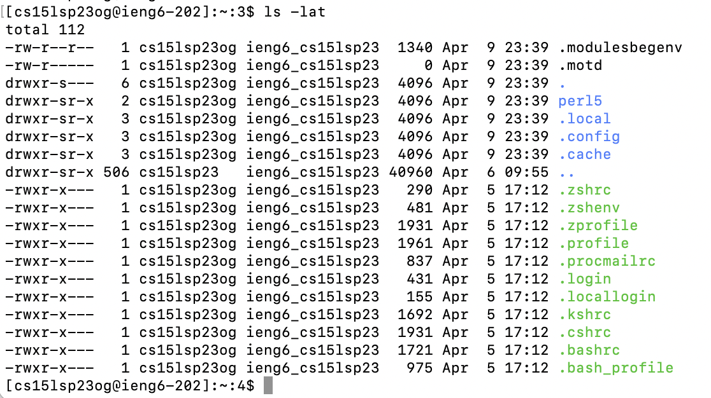
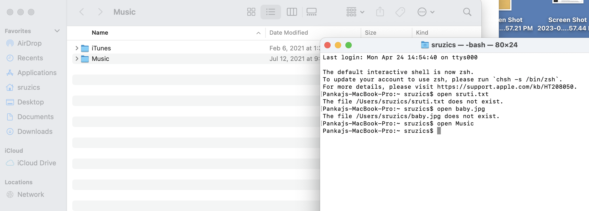

# Lab Report 1
## Installing VS Code:
In order to install VS Code on a Mac, you need to go to the website [https://code.visualstudio.com/](https://code.visualstudio.com/) and follow the instructions to download VS code. You will have to scroll down and click the download button, then follow the prompted instructions. Because I already had VS Code downloaded on my Mac, I did not need to complete this step.



## Remotely Connecting: 
In order to remotely connect, open up your terminal on your Macbook (you can search this up in the searchbar). Type in the following command into the terminal, replacing the "zz" with your personal account letters:
```
ssh cs15lsp23zz@ieng6.ucsd.edu
```
Initially, this did not work for me, but it was eventually fixed and I was able to see the screen shown below. Now, you are logged in and your computer is connected to a computer in the CSE basement.



## Trying Some Commands:
Now that you have logged in, you can try some commands. These include `cd`, `ls`, `pwd`, `mkdir`, and `cp`. You can test these commands out and any other commands in the terminal to see the ouput. Here are some examples of commands:
* You can use the `touch` command to create a new file. In your terminal, simply type a file name next to the touch commmand to create a new file with your desired file name. See the example below:

* You can use the `ls -a` command to show all of the hidden files. This will leave See the example below:

* You can use the `clear` command to clear the terminal of all commands that were entered. This will also remove the fact that you entered clear, so be aware of that.

* The `rm` command removes a file. You need to enter rm and then the name of the file that you want to remove next to it. Nothing will output from it. 

* In order to open a specific file, you need to use the `open` command. Type open and then the file you want to open and the file will open in the directory.
 
