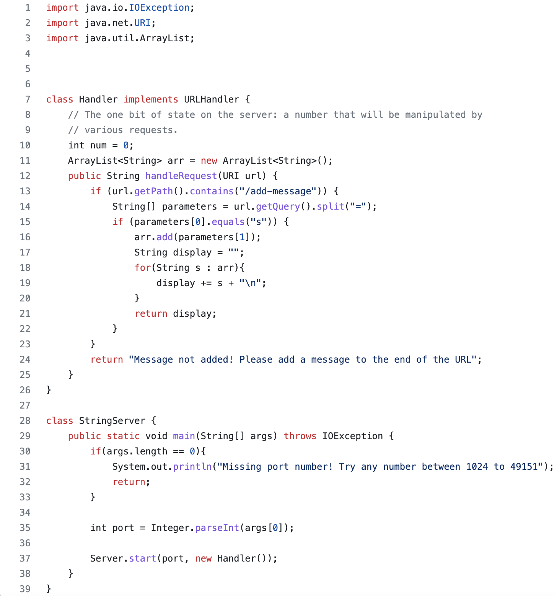
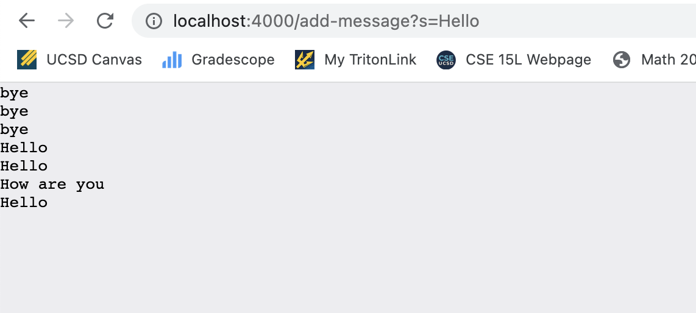

# Lab Report 2
## Part 1
Based off of lab 2, I created a similar web server but instead one that takes strings into the URL rather than numbers. You would need to append `/add-message?s=<string>` at the end of the http://localhost: URL. 

In order to create this, I had to change up the previous code to have the input be strings and append to an array list that was then displayed. You will need to compile the code in order for it to be displayed in the local host. Then you can go to the local host URL and test this out by appending different strings. The new phrases will be added below the old ones. 

As you can see, in the above image, I added "Hello" as my message and it appended it to the array list that already existed. This is why all of my previous appended phrases are also shown as it is saved. When this is typed in the URL, the handleRequest method is used. This method takes the URL and checks to see if the /add-message is added to the URL. If it is, then it will analyze the message part of it and add it to the page then create a new line after. If the /add-message was not found, then a "Message not found" message will display.

Next, I added a new message "How are you" which was next displayed on the screen right after as well as my previous message "Hello". The handleRequest method is called again and it runs through the same if else statements. The new message is added in this case below the "Hello" message. The previous message is saved onto the page. 


## Part 2
The failure inducing input for the buggy program is the following JUnit test:
```
@Test 
	public void testReverseInPlace() {
    int[] input1 = {1, 2, 3, 4, 5};
    ArrayExamples.reverseInPlace(input1);
    assertArrayEquals(new int[]{5, 4, 3, 2, 1}, input1);
```

The input that does not input a failure is the following JUnit test:
```
@Test 
public void testReversed() {
    int[] input1 = {1, 2, 3, 4, 5};
    ArrayExamples.reverseInPlace(input1);
    assertArrayEquals(new int[]{5, 4, 3, 2, 1}, input1);
```

The symptom is the fact that the code does not even compile when you run it. As you can see below, the code itself produces 6 errors.


The original code is as follows:
```
  static int[] reversed(int[] arr) {
    int[] newArray = new int[arr.length];
    for(int i = 0; i < arr.length; i += 1) {ymptom
      arr[i] = newArray[arr.length - i - 1];
    }
    return arr;
  }
```

I fixed the code by implementing a few changes:
```
  static int[] reversed(int[] arr) {
    int[] newArray = new int[arr.length];
    for(int i = 0; i < arr.length; i += 1) {
      newArray[i] = arr[arr.length - i - 1];
    }
    return arr;
  }
```
This fix addresses the issue because it ensures that the reversed order is copied into the new array that was initially created.


## Part 3
Lab 2 was definitely a lab where I learned the most because I did not realize that just by changing the URL, I could change what is displayed on a website. I think this lab definitely showed me a lot of behind the scenes about URLs that I did not learn in a previous class or any other CS class. This expands a lot of possibilities regarding web development which is something I have experience in. Lab 3 was nothing new to me because it was all coding and JUnit testing which is what I am working on in CSE 12. But, I liked that this lab was a good brush up on it.
